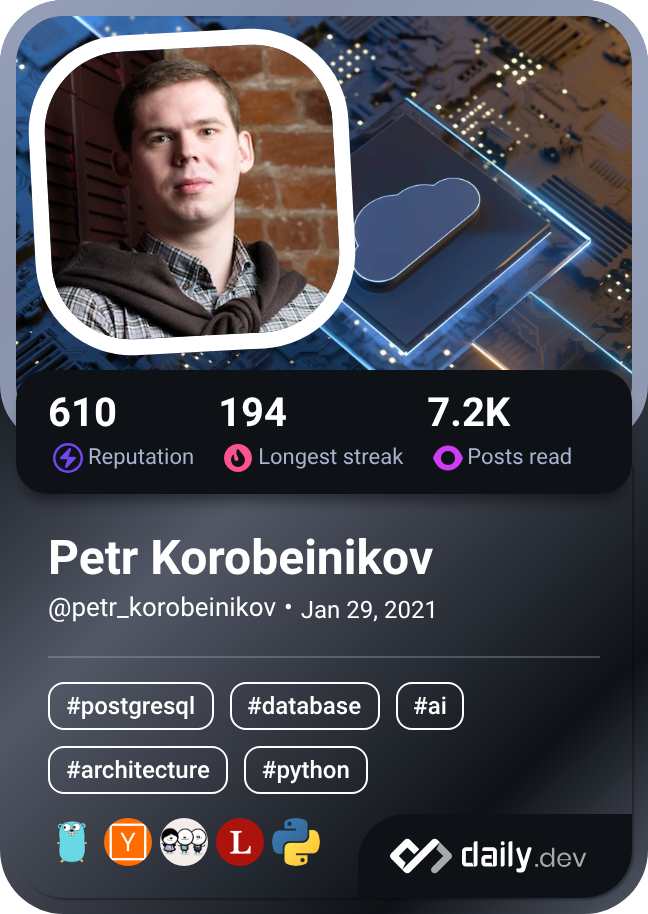

### Petr Korobeinikov 👨‍💻

I am TechLead and Software Engineer building ~~a cloud currently at [#CloudMTS](https://cloud.mts.ru/)~~.

#### 🛠 Tech Stack

- Kotlin + Spring Boot
- Go
- ~~Python~~
- Kubernetes
- Postgres
- Kafka

#### ✍️ Blogging

- [Principal Engineering Youtube Channel](https://www.youtube.com/@principal-engineering) (russian)
- [Principal Engineering Telegram Channel](https://t.me/principalengineering) (russian)
- [Principal Engineering Blog](https://principal-engineering.ru/) (russian)

#### 📝 Publications

- Habr.com (russian):
  - 2026-02-16, MTS: [GraphQL и Go — gqlgen после года в проде: опыт, советы и выводы](https://habr.com/ru/companies/ru_mts/articles/994594/)
  - 2023-05-30, MTS / #CloudMTS: [Создаем типовое локальное окружение для разработчика](https://habr.com/ru/companies/cloud_mts/articles/735350/)
  - 2023-05-17, MTS / #CloudMTS: [Несколько мыслей по подготовке к алгоритмической части собеседования](https://habr.com/ru/companies/cloud_mts/articles/735348/)
  - 2023-03-14, MTS / #CloudMTS: [Как мы сделали для разработчиков универсальную шину событий, не требующую знаний Kafka и прочих брокеров](https://habr.com/ru/companies/cloud_mts/articles/721964/)
  - 2017-09-10, Avito: [Встречаем PostgreSQL 10. Перевод Release Notes](https://habr.com/ru/companies/avito/articles/339520/)
  - 2017-08-29, Avito: [Чемпионат #PGHACK. Платформа](https://habr.com/ru/companies/avito/articles/336246/)
  - 2017-08-07, Avito: [PGHACK. Соревнование в офисе Avito 2 сентября](https://habr.com/ru/companies/avito/articles/334886/)

#### 📫 Public Profiles

- LinkedIn: https://www.linkedin.com/in/petr-korobeinikov
- LeetCode: https://leetcode.com/petr-korobeinikov
- Habr: https://habr.com/ru/users/petr-korobeinikov
- DailyDev: https://app.daily.dev/petr_korobeinikov

